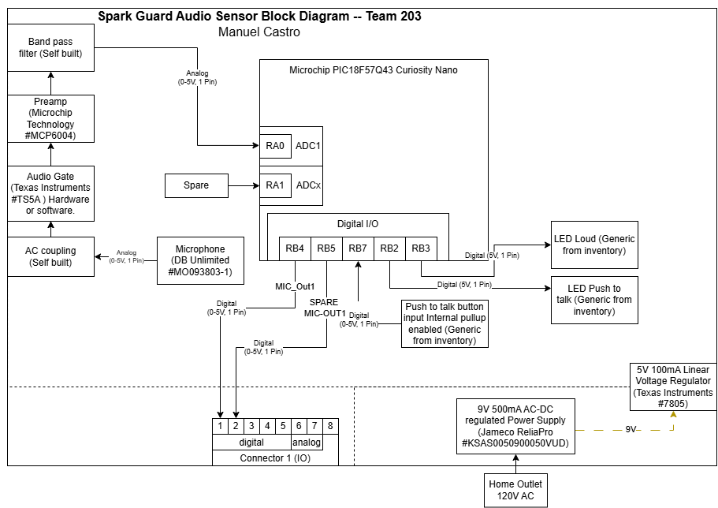

## Overview

The purpose of this diagram is to quickly visualize the scope of the prototype PCB I am building with all core functions. The diagram will show the power required for each component and what components will be supplying this power with labeled arrows. The PCB is compossed of a group of components chosen to help achieve voice activation, sent out a digital signal to operate a solenoid actuator on separate PCB, and protect the outlet from tampering with a cover. As you will note after looking at the diagram, there are only outbound connections from this PCB. This PCB serves as the initiator of the logic chain.
Below are some bullet points with relevant informaiton:  
* **Power** 
The components use power from two different sources. The main one being the 9V 500mA DC wall adapter plug, then a linear voltage regulator, operating at 5V/100mA  
* **Sensor** 
There is one microphone analog sensor that will provide data to our PIC for use as our voice sensor.  
* **Push Button** 
The push button serve as a push to talk to prevent the microphone from always listening.  

## Block Diagram 
Originally, I had the idea to have a photoresistor work as our trigger for our actuator. I decided against it since we wanted something more secure that would not be triggered by wildlife or children, so I came up wiht a microphone activated actuator sensor. This sensor will process a loud voice, then it feeds it to an op amp for some amplification, then a bandpass filter to remove hisses and rubmlings and other common outdoor noices. The filtered and amplidied signal is then fed into the PIC, which converts the signal from analog to digital so it can decide if the voice was loud enough to trigger a digital out command. If it is, it will send a high signal to the 8 pin connector via a GPIO pin to feed it to Ayush's actuator PCB.

I have since added a push button to work as a push to talk to only enable the mic when the button is pressed, there are also debug LEDs connected to the mic signal logic, these receive a signal from the PIC to turn on if the PTT (push to talk) button is pressed and if the voice captured by the mic was loud enough to trigger the digital out command.

 

<object data="https://mcastr11-collab.github.io/EGR304MannyIndividualDataSheet/01-Block-Diagram/Team%20203BlockDiagramFinal.pdf" type="application/pdf" width="700px" height="700px">
    <embed src="https://mcastr11-collab.github.io/EGR304MannyIndividualDataSheet/01-Block-Diagram/Team%20203BlockDiagramFinal.pdf">
        
This browser does not support PDFs. Please download the PDF to view it: <a href="https://mcastr11-collab.github.io/EGR304MannyIndividualDataSheet/01-Block-Diagram/Team%20203BlockDiagramFinal.pdf">Download PDF</a>.

    </embed>
</object>

<!-- Embed PDF File -->
<object src="Team 203BlockDiagramFinal.pdf" type="application/pdf" title="SamplePdf" width="500" height="720">
    <a href="Team 203BlockDiagramFinal.pdf">shree</a> 
</object>
