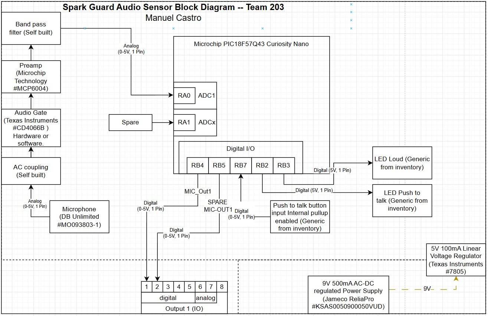

## Overview

The purpose of this diagram is to quickly visualize the scope of the prototype PCB I am building with all core functions. The diagram will show the power required for each component and what components will be supplying this power with labeled arrows. The PCB is composed of a group of components chosen to help achieve voice activation, sent out a digital signal to operate a linear actuator on separate PCB, and protect the outlet from tampering with a weather resistant cover. As you will note after looking at the diagram below, there are only outbound connections from this PCB. This PCB serves as the initiator of the logic chain. Below are some bullet points with relevant informaiton:  
- **Power** 
The components use power from two different sources. The main one being the 9V 500mA DC wall adapter plug, then a linear voltage regulator, operating at 5V/100mA  
- **Sensor** 
There is one microphone analog sensor that will provide data to our PIC for use as our voice sensor.  
- **Push Button** 
The push button serve as a push to talk to prevent the microphone from always listening.  
- **SPARE/ Expansion** 
These are component connections added for redundancy puroses in case the primary component fails. There is one spare lane for the microphone for both signal into the microcontroller and signal out.These may also be added to expand the functionality of this device in the future.  

## Block Diagram 
Originally, I had the idea to have a photoresistor work as our trigger for our actuator. I decided against it since we wanted something more secure that would not be triggered by wildlife or children, so I came up wiht a microphone activated actuator sensor. This sensor will process a loud voice using a bandpass filter to remove hisses and background noise, then it feeds it to an op amp for signal amplification. The filtered and amplidied signal is then fed into the microcontroller, which converts the signal from analog to digital via ADC so it can analyze if the voice was loud enough to trigger a digital out command. If it is, it will send a high signal to the first pin of our 8 pin connector via a GPIO pin, which will feed it to an LED indicator and Ayush's actuator subsystem on a separate PCB. Please see [Team 203 Spark Guard](https://egr304-203.github.io/sparkguard/06-Team-block-diagram/) to view our team block diagram with all subsystems put toghether.

In addition, I added a push button to work as a push to talk to only enable the mic when the PTT (push to talk) button is pressed, there is also a LED connected to the mic PTT button signal via code. This LED is programmed to receive a signal from the microcontroller to turn on if the PTT (push to talk) button is pressed.

 

