## Major component selection

> Below are examples of what subcomponent options could fullfil the roles of the following components. 

*Table 1: Individual component selection (prox sensor)*

**A-Proximity Sensor** **[Proximity Sensor Component]** 
> It needs to detect a nearby hand/body; analog output; works at 5 V; supports custom active conditioning. 
1. TCRT5000 element (IR LED + phototransistor) 

    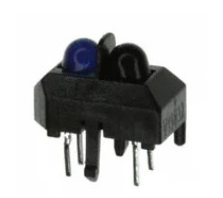

    * $1-2/each TCRT5000
    * [Link to PDV-P8103](https://www.digikey.com/en/products/detail/advanced-photonix/PDV-P8103/480610)

    | Pros                                                              | Cons                |
    | ----------------------------------------------------------------- | ------------------- |
    | True analog output                                            | Needs mechanical aiming |
    | Easy to bias                                   | Ambient light can effect performance   |
    | Inexpensive 

1. LDR (photoresistor PDV-P8103) + LED

    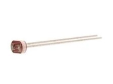  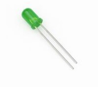

    * $1/each PDV-P8103 [Link to PDV-P8103](https://www.digikey.com/en/products/detail/advanced-photonix/PDV-P8103/480610)
    * $0.08/ each for LED [Link to Green LED](https://www.digikey.com/en/products/detail/lumimax-optoelectronic-technology/LEDDC-5GRE/26680606) 

    | Pros                                                              | Cons                |
    | ----------------------------------------------------------------- | ------------------- |
    | Robust people detection                                           | Slower     |
    | Stable over operating temperature                                 | Temperature/ambient drift |
    | Direct interface with PSoC (no external circuitry required) range | Requires more assembly

1. PIR Motion Sensor (LHI968)

    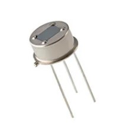

    * $6/each LHI968
    * [Link to LHI968](https://www.digikey.com/en/products/detail/excelitas-technologies/LHI-968-3866/5885894)

    | Pros                                                              | Cons                |
    | ----------------------------------------------------------------- | ------------------- |
    | Outputs a square wave                                             | More expensive      |
    | Built-in amp/comparator                                           | Gives digital output, no analog output |

1. Analog Distance Sensor Sharp/Socle (GP2Y0A41SK0F)

    

    * $13.95/each LHI968
    * [Link to LHI968](https://www.pololu.com/product/2464)

    | Pros                                                              | Cons                |
    | ----------------------------------------------------------------- | ------------------- |
    | Good range for hand detection (4-30cm)                            | Most expensive option      |
    | Analog voltage readout                                            | Distance < 4 cm will provide throw away readings and will need to be addressed in design |
    |High resolution measurements|

**Choice:** Option 1: TCRT5000 element

**Rationale:** Analog current/voltage proportional to reflected light and pairs well with a custom MCP6002 gain + active low-pass filter stage to satisfy project requirements. The cost also makes this a viable option.

*Table 2: Individual component selection (Op-Amp)*
**B-Signal Conditioning Op-Amp** **[Proximity Sensor Component]** 
> It needs a 5 V single supply, rail-to-rail I/O, low power, enough bandwidth for ~10–50 Hz.
1. MCP6002 (dual, 1 MHz GBW)

    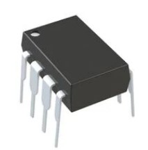

    * $0.44/each
    * [Link to MCP6002](https://www.digikey.com/en/products/detail/microchip-technology/MCP6002-I-P/500875)

    | Pros                                                              | Cons                |
    | ----------------------------------------------------------------- | ------------------- |
    | RRIO at 1.8–5.5 V                                             | Not great for precision |
    | Ultra-low supply current                                     | Low kHZ support          |
    | Good for low-frequency gain + Sallen-Key LPF    

1. MCP6022 (dual, 10 MHz)

    

    * $1.86/each
    * [Link to MCP6022](https://www.digikey.com/en/products/detail/microchip-technology/MCP6022-I-P/417828)

    | Pros                                                              | Cons                |
    | ----------------------------------------------------------------- | ------------------- |
    | More bandwidth                                                    | More expensive      |
    | 5 V single-supply                                                 | Higher current draw |
    |  |
    
1. TLV2462 (dual, ~6.4 MHz)

    

    * $1.86/each
    * [Link to MCP6022](https://www.digikey.com/en/products/detail/microchip-technology/MCP6002-I-P/500875)

    | Pros                                                              | Cons                |
    | ----------------------------------------------------------------- | ------------------- |
    | RRIO                                                              | More expensive than MCP6002      |
    | 2.7–6 V supply                                                    | Higher current draw |
    |  |

**Choice:** Option 1: MCP6002

**Rationale:** Meets performance with minimal power and gives two amps for gain + active LPF, it is also the least expensive option.

*Table 3: Individual component selection (Voltage Regulators)*
**C-Voltage regulators** **[Power Components]** 

> We need a 6V and a 5V voltage regulator to step down from 9 or 12V.  

1. LM2596 **6V**

    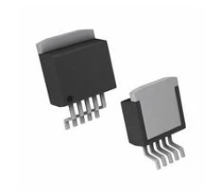

    * $6.97/each
    * [Link to LM2596](https://www.digikey.com/en/products/detail/texas-instruments/LM2596S-5.0-NOPB/334842?utm_source=chatgpt.com)

    | Pros                                                            | Cons                |
    | --------------------------------------------------------------- | ------------------- |
    | Capable of 3 amp output                                                  | Large size |
    | Adjustable version fives votage flexibility  | Input Voltage limited to 40V           |
    | 

1. TPS564201DDCR **6V**

    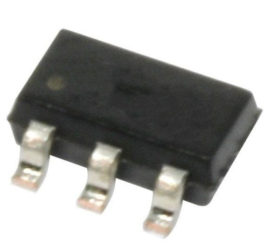

    * $1.26/each
    * [Link to TPS564201DDCR](https://www.mouser.com/ProductDetail/Texas-Instruments/TPS564201DDCR?qs=zEmsApcVOkUKQpyzRnH%2FcQ%3D%3D&mgh=1&utm_source=chatgpt.com)

    | Pros                                                              | Cons                |
    | ----------------------------------------------------------------- | ------------------- |
    | Cheaper                                                    | Over specced      |
    | Highest current capacity at 9 amps                             | Requires custom footprint |
    | Swithching regulator |
    
1. D45V5F5 **5V**

    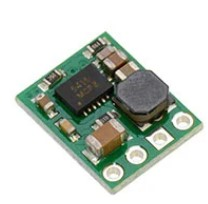

    * $8.95/each
    * [Link to D45V5F5](https://www.digikey.com/en/products/detail/pololu/2843/10451170?utm_source=chatgpt.com)

    | Pros                                                              | Cons                |
    | ----------------------------------------------------------------- | ------------------- |
    | Generous votlage range                                            | Current output limited to 500 mA      |
    | Compact size                                                    | Fixed 5V output |
    |  |

1. D24V90F5 **5V**

    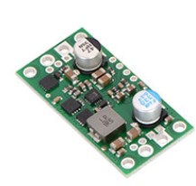

    * $36.82/each
    * [Link to D24V90F5](https://www.digikey.com/en/products/detail/pololu/2866/10451188?utm_source=chatgpt.com)

    | Pros                                                              | Cons                |
    | ----------------------------------------------------------------- | ------------------- |
    | Higher amperate raiting                              | More expensive than MCP6002      |
    | 2.7–6 V supply                                                              | More heat |
    | |

**Choice:** Option 1 & 3: LM2596 and D45V5F5

**Rationale:** Meets project requirements and are flexible enough for what we are trying to do with DC motors.

## Updated Component Selection

I updated my component list to show the current scope of our project.

1. Microphone with leads (CMEJ-4618-42-L010)

    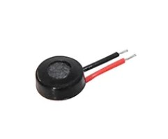

    * $0.53/each PDV-P8103 [Link to CMEJ-4618-42-L010](https://www.digikey.com/en/products/detail/same-sky-formerly-cui-devices/CMEJ-4618-42-L010/10253438)

    | Pros                                                              | Cons                |
    | ----------------------------------------------------------------- | ------------------- |
    | It comes with wire leads                                          | 7 week lead time     |
    | Omnidirectional                                                   | Omnidirectional |
    | Good frequency and DB range                                       | 

1. THT Microphone (PMOF-9745P-39UQ)

    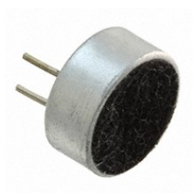

    * $0.72/each PMOF-9745P-39UQ [Link to PMOF-9745P-39UQ](https://www.digikey.com/en/products/detail/mallory-sonalert-products-inc/PMOF-9745P-39UQ/6564381)

    | Pros                                                              | Cons                |
    | ----------------------------------------------------------------- | ------------------- |
    | 20-16 kHZ range very generous                                     | Less sensitivity     |
    | Stable over operating temperature                                 | Highest price |
    | Ready to ship                                                     | No wire leads

1. THT Microphone  (MO093803-1)

    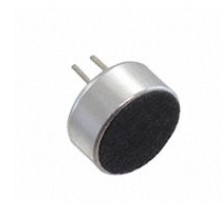

    * $0.70/each MO093803-1 [Link to MO093803-1](https://www.digikey.com/en/products/detail/db-unlimited/MO093803-1/9990559)
 

    | Pros                                                              | Cons                |
    | ----------------------------------------------------------------- | ------------------- |
    | 50HZ-16kHZ range good                                          | No wire leads     |
    | Omnidirectional                                                | Less install flexibility |
    | Ready to ship                                                  | Higher price

**Choice:** Option 1: CMEJ-4618-42-L010

**Rationale:** It is the most flexible option as it would allow us to reolcate the microphone outside the an enclosure since it comes with wire leads out of the box. It is also the least expensive option, but if the 7 week lead time is not enough time to receive it before the end of the semester, then the MO093803-1 would be a decent alternative with a good frequency range and slighly more complicated assembly.