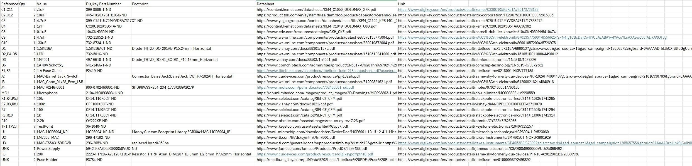

## Overview
Below is the build of materials for my individual design. Most of the parts were easily found in stock and available on Digikey. I have listed the corresponding datasheet and link for each component in the donwloadable excel file under "Resources" at the bottom of the page.

## Bill of Materials  

{style width: "2000"}
**Figure 2:** Bill of Materials.  

## Resouces

The final BOM excel file can be donwloaded [*here*](Manny-sparkguard-BOM Final.xlsx),