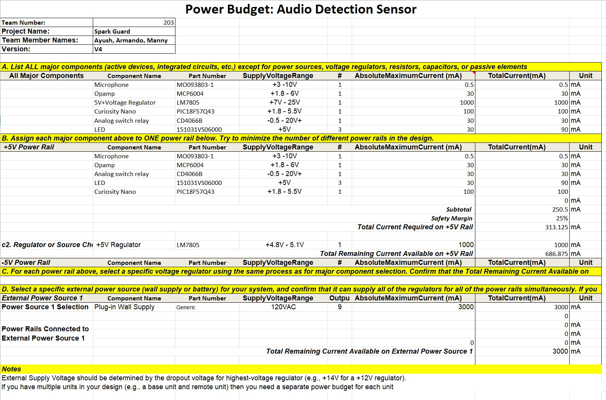

## Overview

To do the power budject, I looked at each component of my susbsystem and researched their datasheet specs for current draw, voltage range, and so on. With this information, I used an already built spreasheet to see if my component selection made sense with the available power I had from my voltage regulator and my supply voltage from the AD to DC adapter I had selected. This is important to ensure my circuit is safe and the supply components are capable of supporting the load downstream.

> Below is my most up to date power budget for the project. The older versions can be found in as archived versions in the file dowload links under "Resources" section at the bottom of the page.  
Power budget V3
{style width:"350" height:"300;"}  

## Conclusions

The completed power budget demonstrates that the system’s power distribution is well within safe operating limits. The external 9V,  500mA power supply provides ample capacity to drive the regulators and loads simultaneously, with significant current margin remaining. The LM7805 efficiently powers the +5 V rail for PIC, the microphone, the switch, the LEDs, and the operational amplifier. All rails operate below their rated limits, ensuring reliable performance, minimal heat generation, and strong overall power efficiency in the design.

## Resouces

You may access the power budget Microsoft Excel Sheet file [*here*](Power Budget egr 304v4.xlsx).  

The power budget image files are [*HERE](PowerBudgetImages.zip)