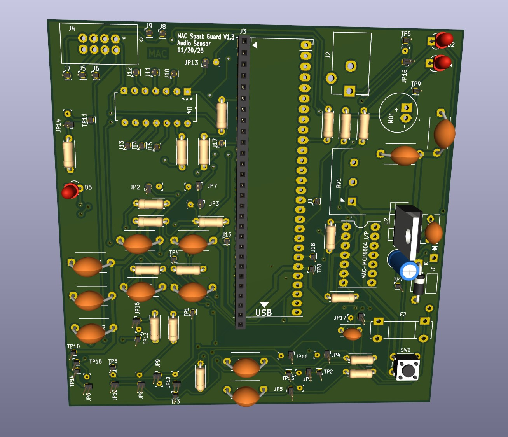
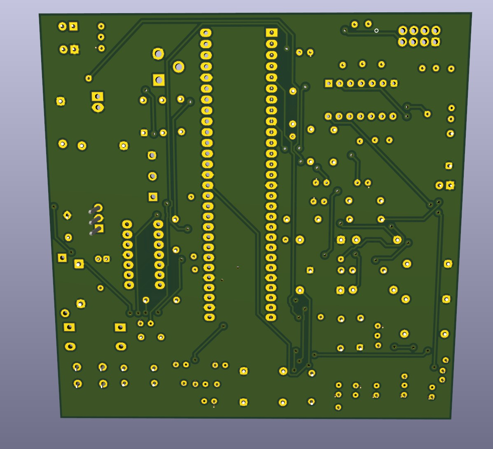
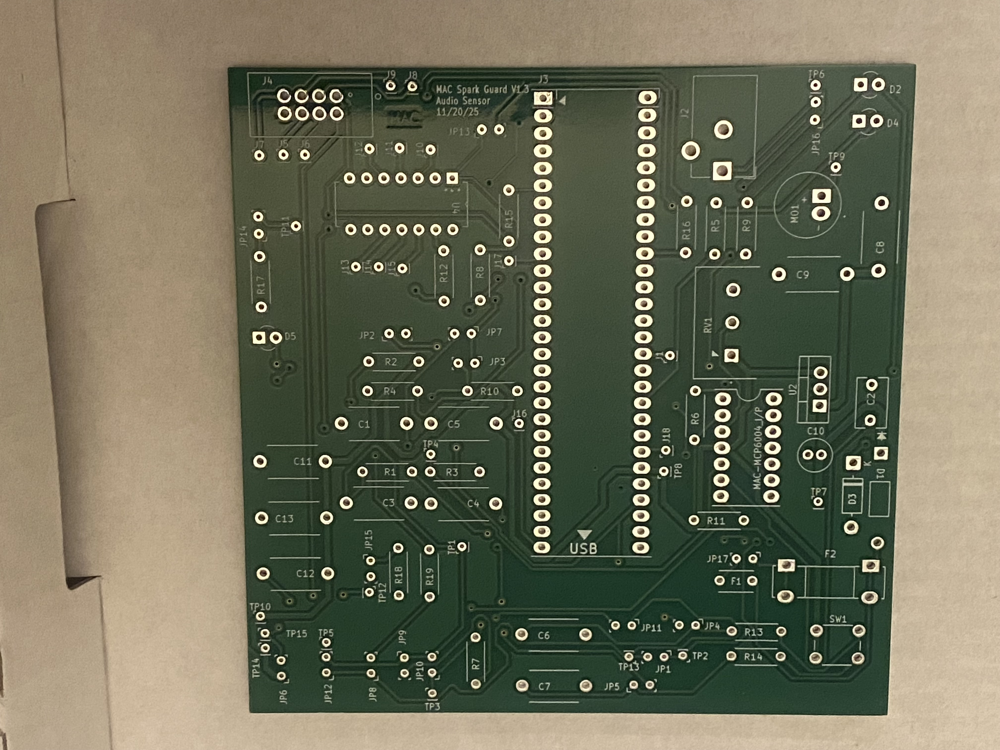
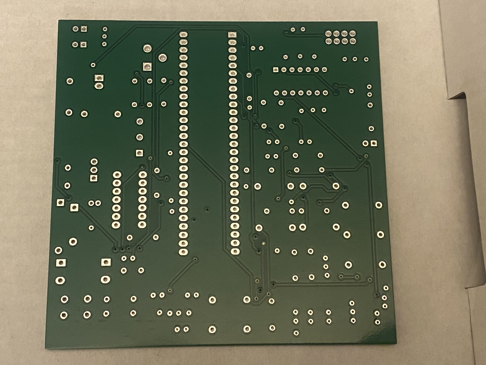
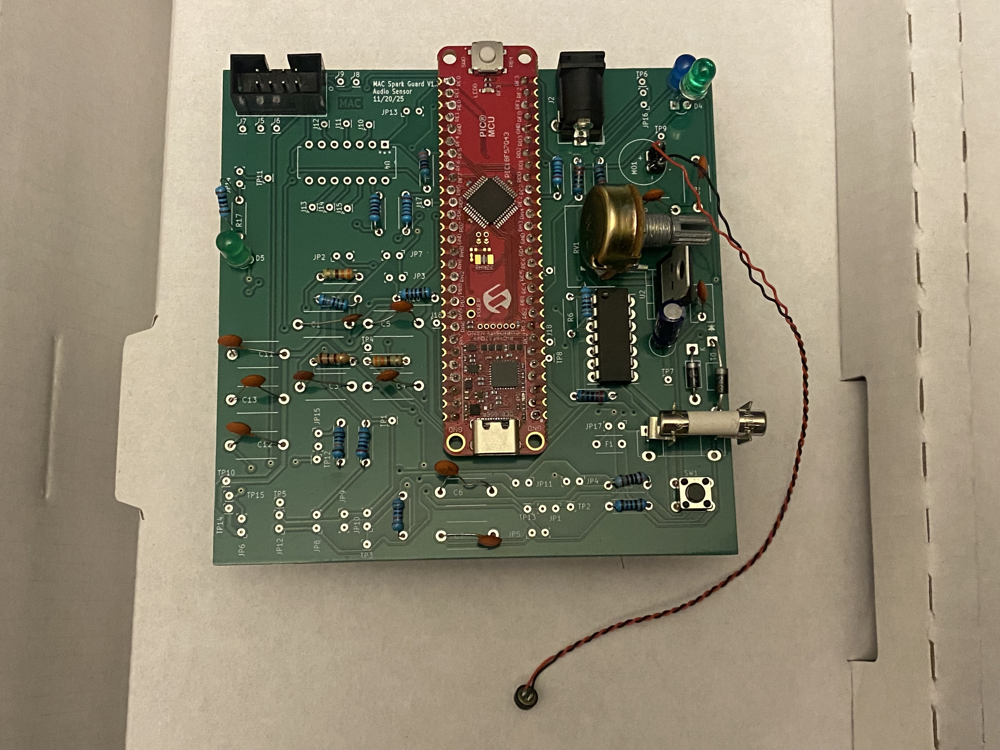

Below is my final pcb print file that was used to spin my prototype board for my audio sensor circuit. You may also download ithe MPLab drill files from the [Resources](https://mcastr11-collab.github.io/EGR304MannyIndividualDataSheet/Appendix/Resources/) page.

<object data="https://mcastr11-collab.github.io/EGR304MannyIndividualDataSheet/06-PCB/MAC Individual SubsystemAudioSensorPCBLayers.pdf" type="application/pdf" width="700px" height="700px">
    <embed src="https://mcastr11-collab.github.io/EGR304MannyIndividualDataSheet/06-PCB/MAC Individual SubsystemAudioSensorPCBLayers.pdf">
        
This browser does not support PDFs. Please download the PDF to view it: <a href="https://mcastr11-collab.github.io/EGR304MannyIndividualDataSheet/06-PCB/MAC Individual SubsystemAudioSensorPCBLayers.pdf">Download PDF</a>.

    </embed>
</object>   

 

  
**Figure 1** Kicad PCB Designer front 3D render of PCB
 

  
**Figure 2** Kicad PCB Designer back 3D render of PCB
 

  
**Figure 3** Picture of the front of the RAW PCB
 

  
**Figure 4** Picture of the back of the RAW PCB
 

  
**Figure 4** Picture of the partialy assembled PCB
 