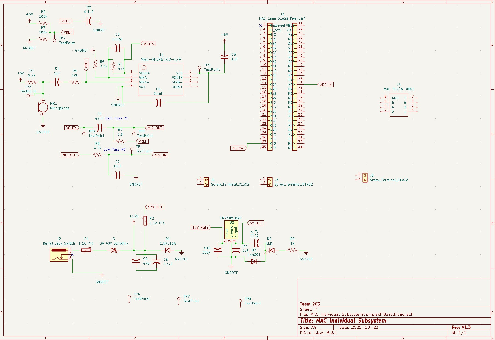
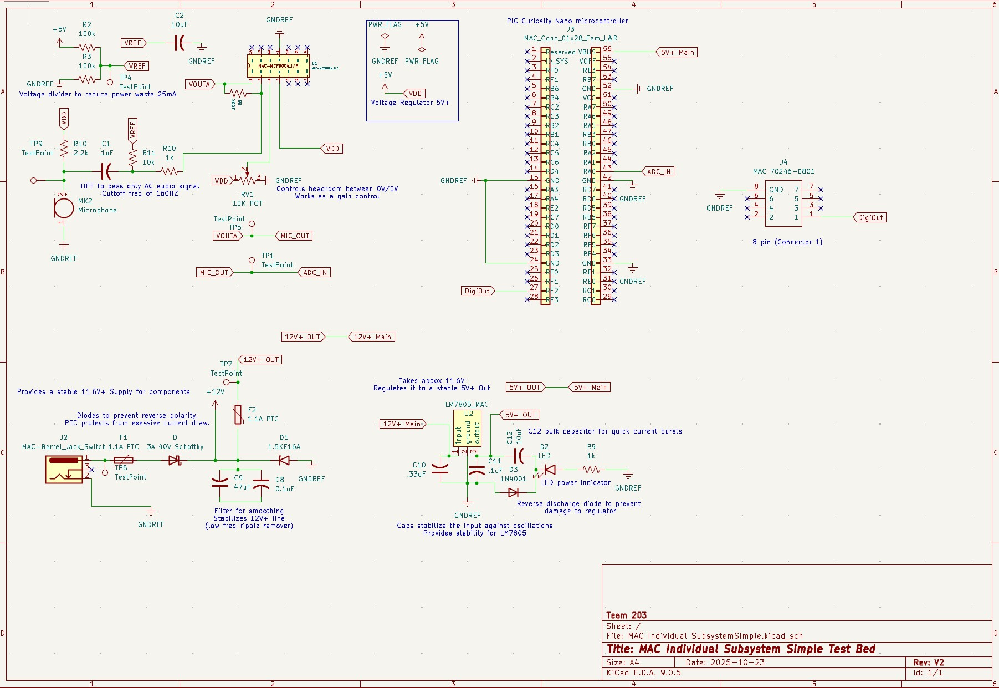
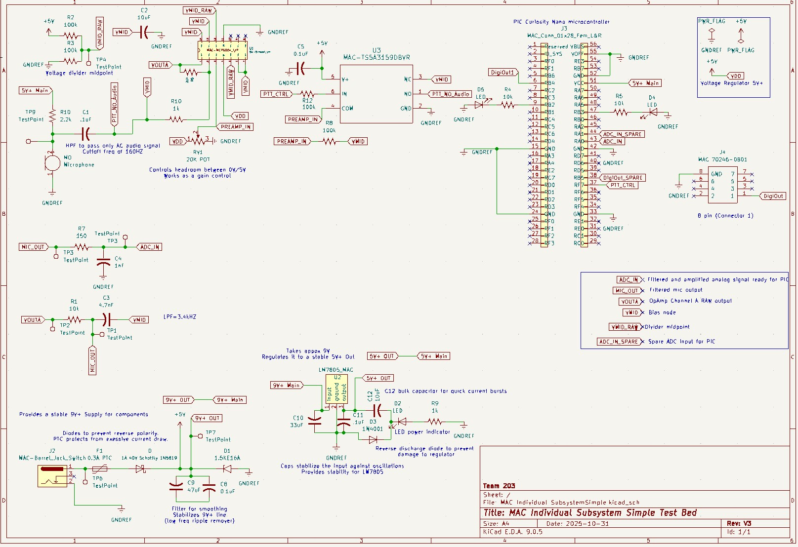

**Old Audio Sensor Block Diagram**
 
This block diagran was updated with an easier to read version with the latest design changes in mind for the voice sensor. Thisone also contained highlighted text which was removed from the final version.

{style width:"350" height:"300;"}
**Figure 1:** Version 1 of my schematic.
In this schematic, I tried to leverage filters to capture a specific amplitude leveraging a Goertzel algorithm as a digital signal processor to measure the strenght of specific frequencies. This would have been excellent to capture high intensity voices such as a close whistle or a scree. Although for testing purposes, I decided to put this idea to the side for now until I understand its application with more detail.

{style width:"350" height:"300;"}
**Figure 2:** Simplified schematic.
In this schematic, I utilized the same idea from a previous in class lab to send a clean analog signal from the microphone, after a high pass filter, to our Curiosity Nano PIC. It complies with our project requirement of having voice recognition to trigger a digital signal from my PIC to activate a solenoid and open the protective cover of the Spark Guard. This was mainly picked due to time constraints and to reduce development costs for the test bed product.

{style width:"350" height:"300;"}
**Figure 3:** Updated schematic.
This is my most up to date schematic in which I changed the last design a bit in order to add a push to talk function in order to add more security. The design also adds a band pass filter and it changed the supply voltage from the AC to DC converter to 9V DC. The changes add more features without overcomplicating the end result and it stays true to the voice recognition requirements.